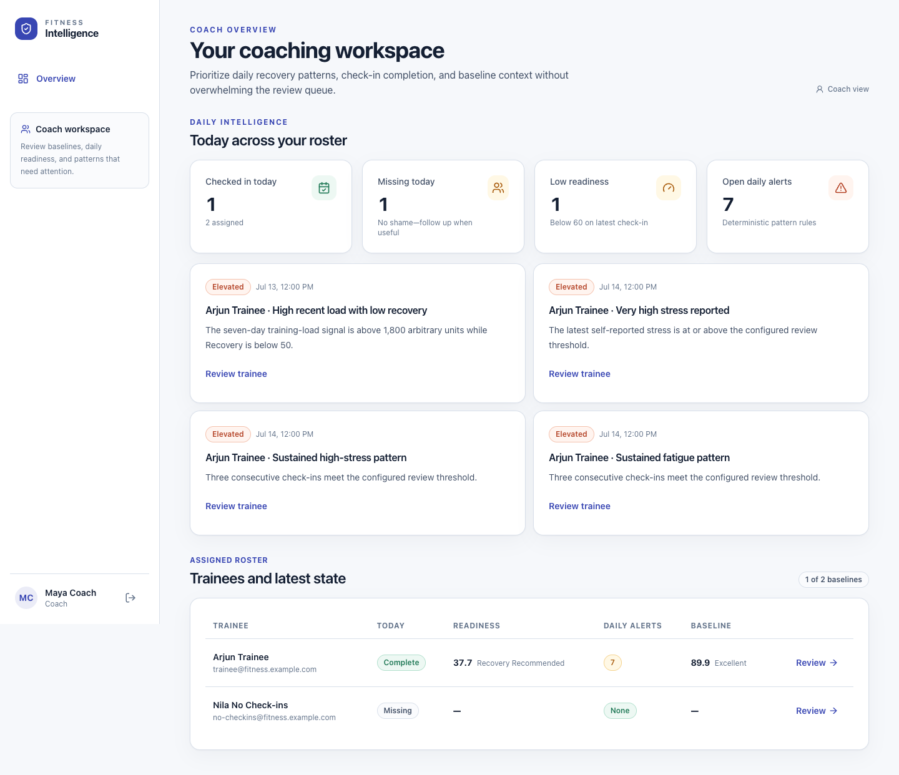
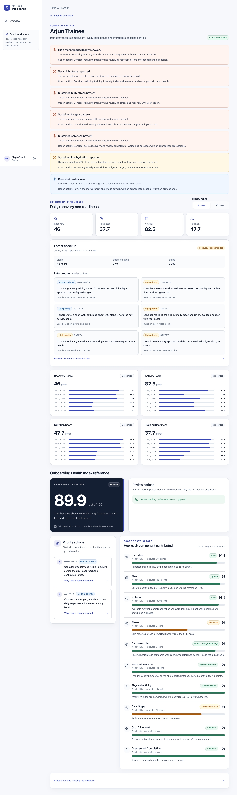

# Getting Started

This guide explains how to access and begin using an already running local copy of the Fitness Intelligence Platform. For installation and startup commands, see the root [README](../README.md). For an overview of the scores and product boundaries, read the [Product guide](product-guide.md).

> **Local demonstration only:** The accounts, password, and invite code below are public demo credentials. Do not reuse them for another service, deploy them to a shared or production environment, or enter real health information in the demo.

## Open the application

After the local Docker services are healthy, open:

- Web application: <http://localhost:5175>
- API documentation for developers: <http://localhost:8000/docs>
- Backend health check: <http://localhost:8000/health>

The application redirects signed-out visitors to the sign-in page.


## Demo accounts

| Role | Email | Password | Best use |
|---|---|---|---|
| Trainee | `trainee@fitness.example.com` | `DemoPass123!` | Explore seeded onboarding, daily scores, alerts, and trends. |
| Coach | `coach@fitness.example.com` | `DemoPass123!` | Explore the assigned roster and full trainee detail. |
| Trainee with no check-ins | `no-checkins@fitness.example.com` | `DemoPass123!` | Explore daily empty states. |

The local demonstration trainee invite code is:

```text
FIT-DEMO-2026
```

These credentials are defined by the repository’s demo seed. They are not private production credentials.

## Sign in

1. Open <http://localhost:5175/login>.
2. Enter a demo email and `DemoPass123!`.
3. Select **Sign in**.

A trainee is sent to **Today**. A coach is sent to the **Coach overview**. The server enforces the role as well as the visible navigation, so changing a URL does not grant access to another role.

If the email or password is incorrect, the page shows **Sign-in unsuccessful** and retains the email so you can correct it. The eye button in the password field shows or hides the password.

Sessions use an expiring bearer token stored in browser local storage for this local milestone. When an API request reports that the session has expired, the application clears the visible session and returns to sign-in with a **Session ended** message. There is no password-reset or account-recovery flow in the current application.

## Register a trainee account

Coach self-registration is not available. The registration page creates trainee accounts only.

1. From sign-in, select **Create an account**, or open <http://localhost:5175/register>.
2. Enter a first name and last name. Each must contain at least one character.
3. Enter a valid email address.
4. Create a password of 10–128 characters.
5. Enter the local demo coach invite code `FIT-DEMO-2026`.
6. Select **Create account**.

If registration succeeds, the application signs in the new trainee and opens onboarding. Email addresses are matched without regard to capitalization. A duplicate email, invalid invite code, invalid field, or unavailable coach produces an error and does not create the account.


### How demo assignment works

The invite code does not select from a list of coaches. In the current implementation, registration assigns the new trainee to the oldest coach account in the database and marks the assignment active and accepted. In the standard local seed, that coach is Maya Coach (`coach@fitness.example.com`).

The application does not currently offer coach invitations with expiry, assignment transfer, removing an assignment, or coach account registration. An assigned coach can read the trainee’s submitted baseline, daily check-ins, daily scores, trends, alerts, and recommendations. A coach without an active assignment is denied access.

## What a trainee sees

Trainee navigation contains three destinations:

| Destination | What it currently provides |
|---|---|
| **Today** | Today’s check-in state, four daily scores, readiness guidance, review signals, recommended actions, calculation explanations, and a compact baseline score-and-band reference. |
| **Progress** | Gap-aware charts and data tables for 7 or 30 days. |
| **Assessment** | The onboarding flow, a resumable draft, or the responses from a submitted assessment. |

The check-in form is opened from Today. On mobile, Today, Progress, and Assessment appear in the bottom navigation.

The current trainee interface does **not** provide a routed page for the full Health Index component breakdown. Today shows only the baseline overall score and band. The assigned coach can see the full baseline breakdown in the trainee record.


### If onboarding is incomplete

1. Open **Assessment**.
2. Continue from the first incomplete section selected by the application.
3. Correct any highlighted required fields.
4. Use **Save progress** to save the current draft, or **Save and continue** to validate the current section, save, and move forward.
5. On Review, check the answers and select the acknowledgement confirming that they are accurate to the best of your knowledge and that the score is coaching support, not a diagnosis.
6. Select **Calculate my baseline**.

The assessment has 11 screens: Welcome, Goal, Profile, Hydration, Sleep, Movement, Training, Stress, Cardio, Nutrition, and Review. Backward navigation is available. Future steps remain locked until reached. If submission fails, the saved assessment remains available to retry.

After submission, Assessment shows the submitted responses. The baseline cannot be edited through the current routed interface. Daily scores can still exist without a baseline, but some target-based Nutrition components may be unavailable.


### Complete today’s check-in

1. Open **Today**.
2. Select **Complete today’s check-in**.
3. Complete Sleep and recovery, Movement and training, Nutrition and hydration, and Overall feeling.
4. If **Did you exercise?** is Yes, enter exercise duration and session RPE. If it is No, those fields and activity types are cleared.
5. Select **Submit today’s check-in**.
6. Follow **View today’s scores**, or return to Today.

Required information includes sleep and recovery values, steps, the exercise choice, water intake, and overall feeling. Calories, protein, nutrition-plan adherence, activity types, and the short note are optional. Exercise duration and session RPE become required when exercise is reported.

The entry and its scores are saved together. There are no daily drafts or partial daily saves. If validation or the API fails, correct the highlighted information or retry; the form keeps valid entries currently on the page. A failed save does not create a partial scored record.

After saving, use **Edit today** to update the same local-date record. Editing recalculates the same versioned daily snapshot rather than creating a duplicate. Editing is available only until the trainee’s local date changes. Missed or past dates remain gaps and cannot be entered or corrected in the current product.


## What a coach sees

The coach has one primary navigation destination, **Overview**. It contains:

- checked-in-today, missing-today, low-readiness, and open-daily-alert totals;
- up to four current daily-alert cards when alerts exist; and
- an assigned-trainee roster with Today status, latest readiness, daily alerts, and baseline score.

On large screens, the roster is a table. On smaller screens, it becomes a set of cards. Select **Review** or **Review trainee** to open an assigned trainee.



The trainee record includes the latest daily score summary, latest check-in summary, latest recommendations, recent raw check-in summaries, selected trend series, daily alerts, and the full onboarding Health Index reference. The full baseline section includes components, contributions, recommendations, safety notices, missing optional fields, and scoring version.

The coach view is read-only. A coach cannot enter or correct a trainee’s onboarding answers or daily check-ins.



## Sign out

On desktop, select the sign-out icon beside your name at the bottom of the left navigation. On mobile, select the sign-out icon beside your first name in the top bar.

Signing out removes the local access token and user record, then returns to sign-in. Because the token is stored in browser local storage during this milestone, always sign out before leaving a shared device. Closing a tab alone does not perform sign-out.

## Important first-use notes

- Use synthetic information in the local demo.
- Scores and bands are coaching guidance, not diagnoses or judgments.
- Training Readiness is not clearance to exercise and does not predict injury.
- Serious, current, or worsening symptoms require appropriate professional attention regardless of the displayed scores.
- The application does not provide emergency care.
- No AI feature is active; scores, alerts, and recommendations come from deterministic versioned rules.
- The repository does not claim HIPAA, GDPR, or other legal compliance.
- Wearables, messaging, reminders, exports, workout plans, meal plans, password recovery, and native mobile apps are not currently available.

## Next guides

- [Product guide](product-guide.md)
- [Trainee user manual](user-manual-trainee.md)
- [Coach user manual](user-manual-coach.md)
- [Frequently asked questions](faq.md)
- [Troubleshooting](troubleshooting.md)
- [Security and compliance notes](security.md)
