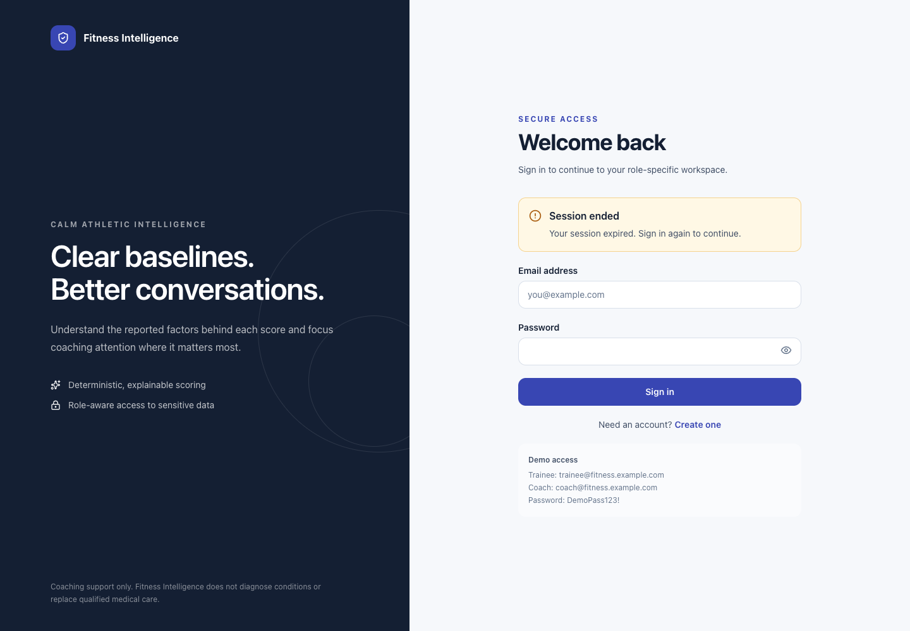

# Troubleshooting

This guide covers the current local Docker and development workflows. Run commands from the repository root unless a step explicitly changes directory. Do not place real secrets in commands, screenshots, or support messages.

For first-time access, see [Getting started](getting-started.md). For product behavior, see the [FAQ](faq.md), [trainee user manual](user-manual-trainee.md), and [coach user manual](user-manual-coach.md).

## Safety first: preserve local data

The normal stop and restart commands preserve the named PostgreSQL volume:

```bash
docker compose stop
docker compose start
docker compose restart
```

Quitting Docker Desktop also stops the application. After reopening Docker, run:

```bash
docker compose up --build --wait
```

> **Destructive reset:** `docker compose down -v` deletes the named PostgreSQL volume. It destroys locally stored accounts, assessments, check-ins, scores, and alerts. Do not run it when you need to retain data.

## End-user troubleshooting

### Cannot sign in

Check the email and password exactly as entered. An unsuccessful attempt displays **Sign-in unsuccessful** and keeps the form available. For the local demo, confirm the backend is running and use the credentials in [Getting started](getting-started.md).

### Invite code is invalid

Choose the intended account type on registration. Coach registration requires the backend-only `COACH_REGISTRATION_CODE`; if it is absent, the route is intentionally disabled. Trainee registration requires an active, unused coach invitation. Ask the coach to create a new invitation if the code was used, expired, revoked, or restricted to another email. Registration errors are intentionally generic and never reveal stored invitation details.

### Onboarding will not save or continue

Read **Check this section** and the inline range message. **Save and continue** requires the current step's required values. **Save progress** does not advance, but an entered out-of-range value anywhere in the draft can prevent the full draft from saving. Valid entries remain on the page after a service failure.

### Assessment will not submit

Return with **Back** and complete every required section. On **Review your assessment**, select **I confirm these answers are accurate to the best of my knowledge**, then choose **Calculate my baseline**. A submitted assessment is locked; duplicate submission does not create another result for the same assessment.

### No Health Index appears

The baseline exists only after onboarding submission succeeds. The trainee **Today** page currently shows a compact **Baseline reference** with score and band; the trainee UI does not currently provide the full component-breakdown screen. **Assessment** shows the locked submitted answers. The assigned coach can see the full baseline breakdown.

### Daily check-in will not save

Correct inline range errors. When **Did you exercise?** is **Yes**, both **Exercise duration** and **Session RPE** are required. Check-ins save as one atomic submission; there is no draft. After a network/API failure, the entered values remain on the form for another attempt.

### Progress is empty or has gaps

Complete at least one daily check-in. Missing local dates are intentionally gaps rather than zero. Use **7 days** or **30 days**; custom ranges are not available in the UI.

### Coach cannot see a trainee

Only an active assignment grants access. The coach cannot add or change assignments in the current UI. An unassigned direct link shows **Trainee access unavailable**.

### A wrong-role page redirects

This is expected. Coaches return to **Overview**, trainees return to **Today**, and signed-out users return to **Welcome back**.

### Session expired

Sign in again when **Session ended** appears. There is no refresh-token or “remember me” flow in the current milestone.



### API unavailable

Use **Try again** after the service returns. Form failures state that entries remain on the page. Avoid refreshing a form until you have copied any unsaved information you need.

### Browser layout looks wrong

Refresh the page at normal browser zoom and use a current browser. The supported responsive design starts at 320 CSS pixels. The coach roster intentionally changes from a table to cards below the desktop breakpoint. If horizontal overflow persists, capture the route, browser, viewport, and a screenshot without sensitive information.

## Local developer troubleshooting

## Start and inspect the Docker application

Build, migrate, explicitly seed the local demo, and wait for health checks:

```bash
docker compose build
docker compose --profile tools run --rm migrate
docker compose --profile tools run --rm seed
docker compose up --wait
docker compose ps
```

The expected URLs are:

- Frontend: <http://localhost:5175>
- API documentation: <http://localhost:8000/docs>
- Backend health: <http://localhost:8000/health>

All three long-running Compose services should become healthy. Migration and synthetic seeding are separate one-off commands and never run in a web replica's startup.

Useful read-only diagnostics are:

```bash
docker compose ps
docker compose logs backend
docker compose logs frontend
docker compose logs db
```

Avoid pasting logs into public channels if they contain environment-specific or personal information.

### Missing `.env`

Compose has local fallback values, so the demo can start without `.env`. If you maintain a personal `.env`, update it yourself using `.env.example` as the contract and use only development values. Never commit `.env` or real credentials.

### Missing or invalid `JWT_SECRET`

The backend requires a signing secret of at least 32 characters. A shorter configured value prevents settings validation/startup. Use a non-default secret for any shared environment; changing it invalidates existing access tokens, so users must sign in again.

### Database is not healthy

Run `docker compose ps` and inspect `docker compose logs db`. The backend waits for PostgreSQL's health check. Do not delete the volume merely because startup is slow.

### Migration failure

Rerun `docker compose --profile tools run --rm migrate` and inspect that command's output. Preserve the database volume before attempting a destructive recovery. The active expected revision for this release is `20260714_0002`.

### Frontend cannot reach the backend

Confirm <http://localhost:8000/health> responds, then verify that the built frontend uses `http://localhost:8000/api/v1` or the intended `VITE_API_URL`. Browser CORS errors require an allowed origin; network errors require the API to be reachable.

### Seed data is missing

Run `docker compose --profile tools run --rm seed` after a successful migration and inspect that command's output. The command is gated to an explicitly enabled synthetic-data environment and is forbidden in production. It creates the three documented local accounts only when they do not already exist. On a persistent volume, existing user data is preserved rather than replaced.

## Docker is unavailable

### “Cannot connect to the Docker daemon” or socket permission error

Start Docker Desktop and wait until its engine is ready, then run:

```bash
docker compose up --build --wait
```

Closing a terminal does not necessarily stop Docker. Quitting Docker Desktop stops containers but should leave the named volume intact.

### A service is unhealthy

Run `docker compose ps`, then inspect the corresponding service log. Common causes include a port already in use, database startup failure, migration failure, or a frontend build error.

Restart without deleting data:

```bash
docker compose restart
docker compose ps
```

If source or dependency files changed, rebuild:

```bash
docker compose up --build --wait
```

## Frontend ports and CORS

Docker and local frontend development both use port 5175:

- Compose publishes nginx at `http://localhost:5175`.
- `npm run dev` starts Vite at `http://localhost:5175`.
- The backend's current default CORS allowlist contains `http://localhost:5175`.

Do not run the Compose frontend and local Vite simultaneously. Stop the Compose frontend before starting Vite:

```bash
docker compose stop frontend
cd frontend
npm ci
npm run dev
```

Open <http://localhost:5175>.

Do not solve a CORS error by disabling browser security or using an unrestricted production allowlist.

## A port is already in use

The Docker application needs host ports 5175 and 8000. Stop the other local process or the conflicting Compose project, then retry. Do not run the Compose frontend and local Vite on port 5175 simultaneously.

Use `docker compose ps` to see whether this project's services already own the ports.

## Sign-in and session problems

### Demo sign-in fails

Confirm that the backend health endpoint responds and use the exact local credentials:

- Coach: `coach@fitness.example.com` / `DemoPass123!`
- Trainee: `trainee@fitness.example.com` / `DemoPass123!`
- No-check-ins trainee: `no-checkins@fitness.example.com` / `DemoPass123!`

The seed is explicit. Run `docker compose --profile tools run --rm seed` and inspect its output if these accounts are missing.

### “Session ended” appears

The access token expired or was rejected. Sign in again. Local tokens are stored in browser local storage for this milestone; there is no refresh-token flow.

### A coach cannot open a trainee

This is expected unless the coach has an active assignment to that trainee. Role and assignment checks are enforced by the backend. There is no coach UI to create or change assignments.

## Missing data and unexpected empty states

### Today says “No check-in yet today”

No record exists for the trainee's current timezone-local date. Choose **Complete today’s check-in**. A record from yesterday does not satisfy today's state.

### Daily score or nutrition is unavailable

Daily scores require a valid submitted check-in. Nutrition remains unavailable when real configured targets or usable optional inputs do not exist; the platform does not fabricate targets.

### Progress has gaps

This is expected. Missing dates remain gaps and are not converted to zero. Use **7 days** or **30 days** to change the bounded range.

### The coach sees only a few raw fields

This is the implemented interface, not a loading defect. **Latest check-in** shows sleep, stress/fatigue, and steps. **Recent raw check-in summaries** shows date, sleep, stress, steps, and overall feeling. The coach UI does not expose every submitted daily field or the note.

### Search, filter, sort, or an attention queue is missing

Those controls are not implemented. The coach overview uses a server-provided roster, four summary metrics, up to four daily-alert cards, and direct **Review** links.

### An alert cannot be dismissed or resolved

There is no alert-resolution UI and no coach mutation for alerts. Daily alert status changes only through deterministic rule evaluation during scoring. Baseline notices remain attached to the immutable baseline snapshot.

## Save and validation problems

### An exercise draft will not publish

Save the draft first and correct every inline or summary error. Required content includes a
name, instructions, category, movement pattern, and at least one primary muscle group. Only
public HTTPS image URLs are accepted. System exercises, archived exercises, and demo sessions
cannot be changed.

### A workout template reports a draft conflict

Another request saved the same draft revision first. The conflict dialog intentionally keeps
your local graph intact. Review or copy any important local changes, then choose the confirmed
reload action to replace them with the latest server draft. Publishing is disabled while the
local draft is dirty.

### An exercise is missing from the template picker

The picker shows only active, published system exercises and active, published private
exercises owned by the signed-in coach. Publish the private exercise, clear the picker filters,
or restore the active root as appropriate. Draft-only, archived, and another coach's exercises
are intentionally excluded.

### A daily check-in will not submit

Review the inline field messages. When **Did you exercise?** is **Yes**, **Exercise duration** and **Session RPE** are required. Valid entries remain on the page after an API failure. Choose **Submit today’s check-in** or **Update today’s check-in** again after correcting the problem.

Daily check-ins save atomically; there is no daily draft. Only the current local date can be edited.

### Onboarding will not continue

Correct the fields in **Check this section**. **Save and continue** validates and saves the current section. **Save progress** saves the draft without moving forward. On the review step, select the accuracy acknowledgement before choosing **Calculate my baseline**.

Submitted onboarding responses are locked and cannot be edited in the current milestone.

## Reset the local demo

Use a reset only when losing all local Docker data is acceptable:

```bash
docker compose down -v
docker compose build
docker compose --profile tools run --rm migrate
docker compose --profile tools run --rm seed
docker compose up --wait
```

The first command permanently removes this Compose project's database volume. Re-run the explicit migrate and seed commands before startup; they cannot recover accounts or edits that existed only in the deleted volume.

The seed is idempotent for records that already exist on a given date. As calendar dates advance, it can add newly shifted synthetic daily-history records; it is not a frozen backup.

For local SQLite development, the documented database is `backend/fitness.db`. Alembic downgrade operations can remove data. In particular, downgrading the daily-intelligence migration deletes daily-only risk alerts and drops the daily tables.

## Run verification

Backend:

```bash
cd backend
../.venv/bin/pytest
../.venv/bin/ruff check app alembic scripts tests
```

Frontend:

```bash
cd frontend
npm run typecheck
npm run build
npm run lint
npm run test
```

End-to-end tests require the Docker frontend at 5175, the API at 8000, and an installed Chrome channel. The Playwright configuration does not start those services:

```bash
docker compose up --wait
cd frontend
npm run test:e2e
```

The end-to-end suite creates test users, updates demo check-ins, and writes screenshots. Run it against disposable local demo data, not a shared or production database.
