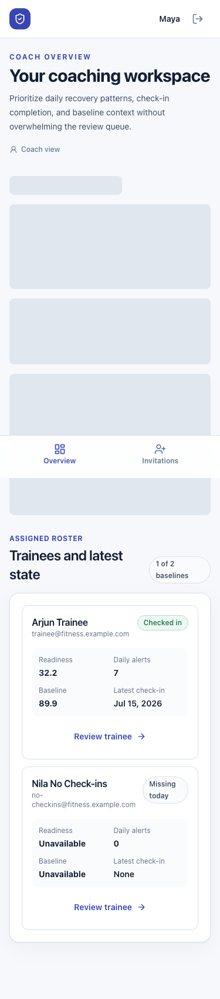

# Coach user manual

This guide describes the coach experience that is implemented in the current Fitness Intelligence Platform. The application provides read-only coaching intelligence from trainee onboarding assessments and daily check-ins. It supports coaching decisions; it does not diagnose, treat, provide medical clearance, or replace qualified medical care.

For an introduction, see [Getting started](getting-started.md) and the [Product guide](product-guide.md). For scoring details, see [Health Index v1](scoring/health-index-v1.md) and [Daily Intelligence v1](scoring/daily-intelligence-v1.md). For setup problems, see [Troubleshooting](troubleshooting.md). Common product questions are answered in the [FAQ](faq.md).

## Public demo access

From sign-in, select **Explore Demo**, then **View as Coach**. The demo opens a fictional seven-trainee roster with varied readiness, check-in, baseline, and alert states. A persistent banner identifies the workspace as synthetic and read-only. You can open roster records and inspect details, but invitation creation and revocation are disabled and rejected by the backend. Select **Exit demo** to leave.

This does not change normal coach enrollment: an ordinary coach account still requires the protected coach registration code.

## Sign in

Open the application and enter the coach email and password on **Welcome back**, then choose **Sign in**. Use **Show password** or **Hide password** when needed.

The local demo coach is:

- Email: `coach@fitness.example.com`
- Password: `DemoPass123!`

Demo credentials are for local evaluation only. They are not suitable for a shared or production deployment.

## Register and invite a trainee

On a clean deployment, choose **Coach** on registration and enter the private coach registration code supplied by the platform owner. The code is checked only by the backend; it is never a Vercel variable. This invitation-only step creates the coach account and profile but does not verify professional credentials.

After sign-in, open **Invitations**. **Restrict to trainee email (optional)** controls who may redeem the invitation; it is not an email-delivery field. Leaving it blank allows any eligible trainee possessing the secret to redeem it. Select a 1, 3, 7, 14, or 30-day expiry and create the invitation. FitIntel 360 sends no email, so use **Copy invitation link** or **Copy invitation code** immediately and share it manually through a trusted channel. Only the hash is stored, and the raw value is not recoverable after refresh. The history shows active, used, expired, and revoked invitations. Only active invitations can be revoked.

## Navigation

Coach navigation contains **Overview**, **Programming**, and **Invitations**.

- On desktop, **Overview** is in the persistent left sidebar.
- On smaller screens, **Overview** is in the bottom navigation.
- Use the sign-out icon beside your identity to end the local browser session.
- On a trainee record, use **Back to overview** to return to the roster.

Trainees can execute assigned workouts and submit safety reports, but coach completed-session analytics, corrections,
messages, analytics reports, nutrition plans, settings, and an alerts-management page are not
implemented.

## Read the coach overview

The overview opens at `/coach/dashboard` and contains two sections.

### Today across your roster

The four summary cards show:

- **Checked in today**: assigned trainees with a check-in for their current local date.
- **Missing today**: assigned trainees without one. This is context for a supportive follow-up, not a failure state.
- **Low readiness**: trainees whose latest readiness score is below 60.
- **Open daily alerts**: currently open deterministic daily-pattern alerts.

When daily alerts exist, up to four alert cards are shown. Each card includes severity, time, trainee, explanation, and **Review trainee**. The low-readiness card is a count; it does not open a separate low-readiness queue.

When no daily pattern needs review, the page says **No daily patterns need review**. This does not mean that the platform has medically cleared anyone.

### Trainees and latest state

The desktop table shows:

- Trainee name and email
- Today's check-in as **Complete** or **Missing**
- Latest readiness score and state, when available
- Open daily-alert count
- Baseline Health Index and interpretation band, when available
- **Review**, which opens that assigned trainee's record

On smaller screens the same roster becomes cards showing readiness, daily alerts, baseline, latest check-in date, and **Review trainee**.

There is currently no search, filter, sort, pagination, selectable row, or dedicated attention-queue control. The displayed order comes from the server. Invitation redemption creates the assignment; there is no action to transfer/remove an assignment, message a trainee, or edit trainee data.

## Review a trainee record

Choose **Review** or **Review trainee**. Coaches can open only trainees with an active assignment; knowing another trainee's identifier does not grant access.

### Daily alerts

Open daily alerts appear near the top. Each notice provides the rule explanation and a **Coach action**. The severity presentation distinguishes informational context, coach review, elevated concern, and urgent safety guidance.

There is no alert acknowledgement, dismissal, note, assignment, or resolution control. Alert state is maintained by deterministic rules when daily scores are recalculated. Coaches cannot manually resolve an alert.

Only alerts that are currently **open** appear in the coach interface. Daily rules can mark an alert **resolved** after later scoring no longer meets the rule, but resolved alerts are not displayed in the current UI. Baseline notices remain attached to the immutable baseline.

The implemented severity meanings are:

| Severity | Meaning in the product |
|---|---|
| Informational | Useful context that is not presented as urgent |
| Review | Coach review is suggested |
| Elevated | The reported value or pattern deserves elevated attention |
| Urgent | Immediate professional-safety guidance for reported chest discomfort or breathing difficulty |

Some daily alerts use only the latest check-in; others use consecutive dates or a seven-day load window. Read the title and explanation for the visible reason. The current interface does not expose the complete triggering date/value payload or label each notice as “one-day” versus “longitudinal.”

If severe or worsening chest pain or breathing difficulty is happening now, the product wording is: “Seek immediate professional medical help.” Do not interpret a product score as diagnosis or medical clearance.

### History range

Use **7 days** or **30 days** under **History range**. This changes the daily score summaries, recent check-ins, and trend data shown for the trainee. Missing local dates remain missing; they are not converted to zero or joined into a continuous history.

### Latest daily intelligence

The summary cards show:

- Recovery
- Readiness
- Activity
- Nutrition, or an em dash when the score is unavailable

The **Latest check-in** section shows the readiness state and only these raw daily fields:

- Sleep duration
- Stress and fatigue
- Steps

Open **Recent raw check-in summaries** to see date, sleep, stress, steps, and overall feeling for the selected range. This is intentionally a limited raw-data view. The coach screen does not display every submitted daily field: soreness, wake-refreshed response, exercise duration, session RPE, activity types, water, calories, protein, nutrition adherence, and the trainee note are not shown in this interface.

The coach cannot edit a check-in. Today's check-in can be edited only by its trainee until that trainee's local date changes; past check-ins are read-only.

### Recommended actions and trends

**Latest recommended actions** shows deterministic actions, their priority/category, and the trigger used. These recommendations are coaching guidance, not prescriptions.

The trainee record shows compact persisted trend summaries for the first four available series. Each includes the latest value and up to seven recorded points. A missing date is omitted rather than shown as zero. There is no coach control to change formulas or recalculate a score manually.

### Onboarding baseline

**Baseline safety notices** are displayed before the baseline score when onboarding rules were triggered. They are separate from daily longitudinal alerts.

**Onboarding Health Index reference** includes:

- Score out of 100 and interpretation band
- Calculation date
- Baseline review notices
- Up to four priority actions
- All score contributors, weights, contributions, statuses, and explanations
- **Why this is recommended** disclosures
- **Calculation and missing-data details**, including scoring version

The onboarding Health Index is immutable and remains separate from daily intelligence. Daily check-ins do not overwrite or recalculate it. A low Health Index product band is not itself a medical finding.

## Common coach workflows

### Confirm who checked in today

1. Open **Overview**.
2. Read **Checked in today** and **Missing today** for roster totals.
3. In **Trainees and latest state**, read the **Today** value for each trainee.

The screen does not send a reminder or message. Follow-up happens outside the application.

### Find an incomplete or missing baseline

1. Open **Overview**.
2. Read the badge beside **Trainees and latest state** for the completed-baseline total.
3. Scan the **Baseline** column or card value. An em dash means there is no submitted Health Index.
4. Choose **Review** for context. The active detail screen does not distinguish every onboarding draft step.

### Review low readiness

1. Check the **Low readiness** total. It counts latest readiness scores below 60.
2. Scan roster readiness values and states to identify the trainee.
3. Choose **Review**.
4. Read the latest Recovery, Readiness, Activity, Nutrition, daily alerts, and recommended actions.
5. Use **7 days** or **30 days** to compare the persisted history.

The low-readiness summary card itself is not a link or separate queue.

### Review an alert or negative pattern

1. Open a visible daily-alert card with **Review trainee**, or choose **Review** from the roster.
2. Read the alert severity, title, explanation, and **Coach action**.
3. Compare the latest daily summary with the selected trend range.
4. Use appropriate coaching judgment and external professional support where indicated.

There is no filter by alert status and no all-alerts page. The overview shows at most four alert cards.

### Review the baseline Health Index

1. Open the assigned trainee.
2. Scroll to **Onboarding Health Index reference**.
3. Read the score, band, date, and review notices.
4. Review **Priority actions** and **Score contributors**.
5. Open **Why this is recommended** or **Calculation and missing-data details** for supporting context.

### Interpret missing data

- An em dash means a score or baseline is unavailable; it does not mean zero.
- Missing dates do not appear as fabricated daily records.
- A Nutrition score can be unavailable when no valid configured nutrition components can be calculated.
- The coach detail shows a limited raw summary, so absence from that screen does not prove the trainee left every other field blank.

### Handle an unassigned-trainee denial

If a coach attempts to open a trainee without an active assignment, the page shows **Trainee access unavailable**. Return to **Overview**. Changing the URL does not grant access, and there is no assignment-management control.

### Respond to serious reported symptoms

Treat an urgent notice as safety guidance, not as a diagnosis. If severe or worsening chest pain or breathing difficulty is happening now, the interface advises immediate professional medical help. Do not delay appropriate care because another score looks favorable.

## Coach permissions and current limits

Trainee health intelligence remains read-only to coaches. A coach can also author content in
**Programming**, while public demo sessions remain read-only everywhere.

### Build an exercise library

Use **Programming → Exercises** to browse system references or **My Exercises**. Private
exercises begin as mutable drafts. Save the draft before publishing; publication freezes that
version. Choose **Create revision** to change published content without rewriting history.
Archiving removes an exercise from future selection while preserving historical references.

### Build a workout template

Use **Programming → Templates → New template**, enter the workout metadata, and add published
exercises through the picker. Order exercises within Warm-up, Main, and Cool-down, then add or
reorder sets. The available prescription fields follow each exercise's tracking mode. Review
the trainee preview before saving and publishing; coach notes never appear in that preview.
If a conflict reports that another tab saved first, keep the local form open until you decide
whether to reload the server draft.

### Build a training program

Use **Programming → Programs → New program** to create a reusable 1–12 week structure. Each
program contains fixed Monday–Sunday weeks. An empty weekday is a rest day; add more than one
workout to a day when needed and use the labelled up/down controls to set its order. Every
workout pins the exact published workout-template version selected at authoring time.

Mark workouts **Required** or **Optional**, add duration or target-RPE overrides when needed,
and mark deload weeks explicitly. A deload label records the coach's intent; the platform does
not reduce volume, intensity, or workouts automatically. Review the trainee preview to verify
trainee instructions and confirm that coach notes are excluded.

Save before publishing. Publication freezes the complete program graph and its pinned template
versions. Choose **Create revision** for later changes, or **Archive** to remove the program from
future active selection while keeping its history readable. A draft-conflict dialog preserves
local edits until you explicitly reload the latest server version.

### Assign a Program

Open **Assignments**, choose an assigned trainee, an exact published Program version, and an
effective trainee-local date. Preview the Monday–Sunday workout calendar before confirming.
The first Program week begins on the first Monday on or after the effective date.

One Program is current at a time. A future replacement preserves earlier schedule history and
marks only displaced future workouts as superseded. The page shows the current assignment,
future replacement, and immutable assignment history. A future replacement can be cancelled;
the current assignment cannot be cancelled through this milestone. Demo controls remain disabled.

Once a trainee starts a scheduled workout, its schedule status becomes **In progress**; normal
completion becomes **Completed**, while an intentional early ending becomes **Partial**. These
states are visible in the trainee's Program calendar and never rewrite the assigned Program or
pinned workout-template version. This phase does not expose the trainee's set log or session-event
history to coaches and does not let a coach reopen or correct an execution.

Open **Safety** to filter open, acknowledged, or resolved trainee workout safety reports. Detail
shows the trainee, workout, linked exercise, category, severity, occurrence time, immutable note,
and append-only review history. **Acknowledge** and **Resolve report** each append a review; they do
not edit trainee content or execution. Safety reports are not monitored continuously. The platform
does not diagnose medical conditions. Use professional judgment and appropriate escalation. Demo
review controls remain disabled.

A coach cannot:

- Create or edit trainee check-ins or onboarding responses
- Change score formulas, recommendations, or readiness states
- Resolve, dismiss, or annotate alerts
- Search, filter, sort, or create a custom attention queue
- Add coach notes
- Send messages or notifications
- Record, reopen, or correct a trainee workout execution, or create nutrition plans
- Create, remove, or change assignments
- Export or delete trainee data

If a control is not described in this guide, do not assume the action exists in the current milestone.

## Privacy and safety

Use trainee information only for the authorized coaching purpose. Avoid copying sensitive values into unrelated systems. The local milestone stores access tokens in browser local storage and is not a production compliance deployment.

Review [Security and compliance notes](security.md) before using the application outside local evaluation. The repository does not claim HIPAA, GDPR, or other legal compliance.
