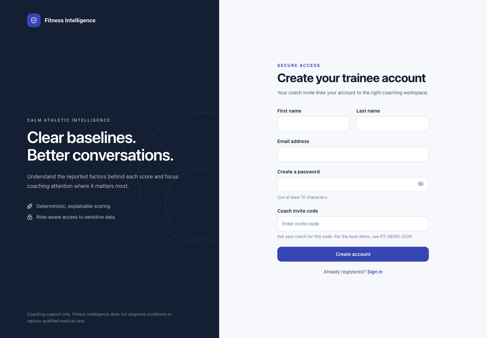
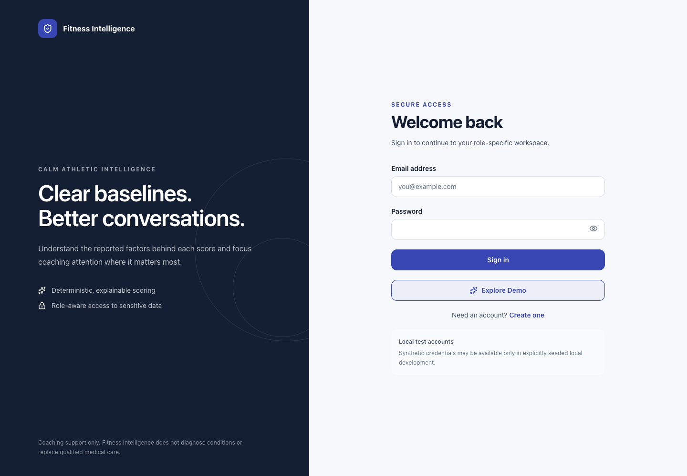
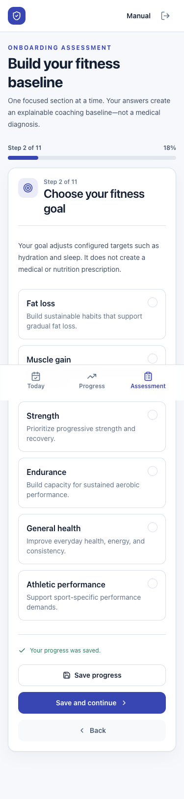
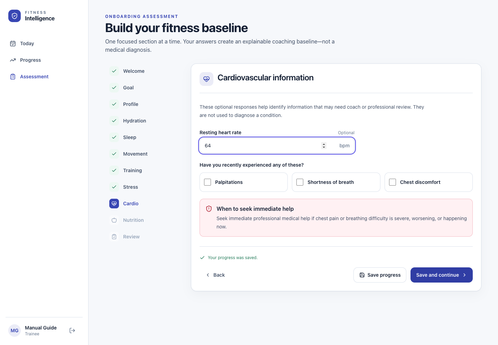
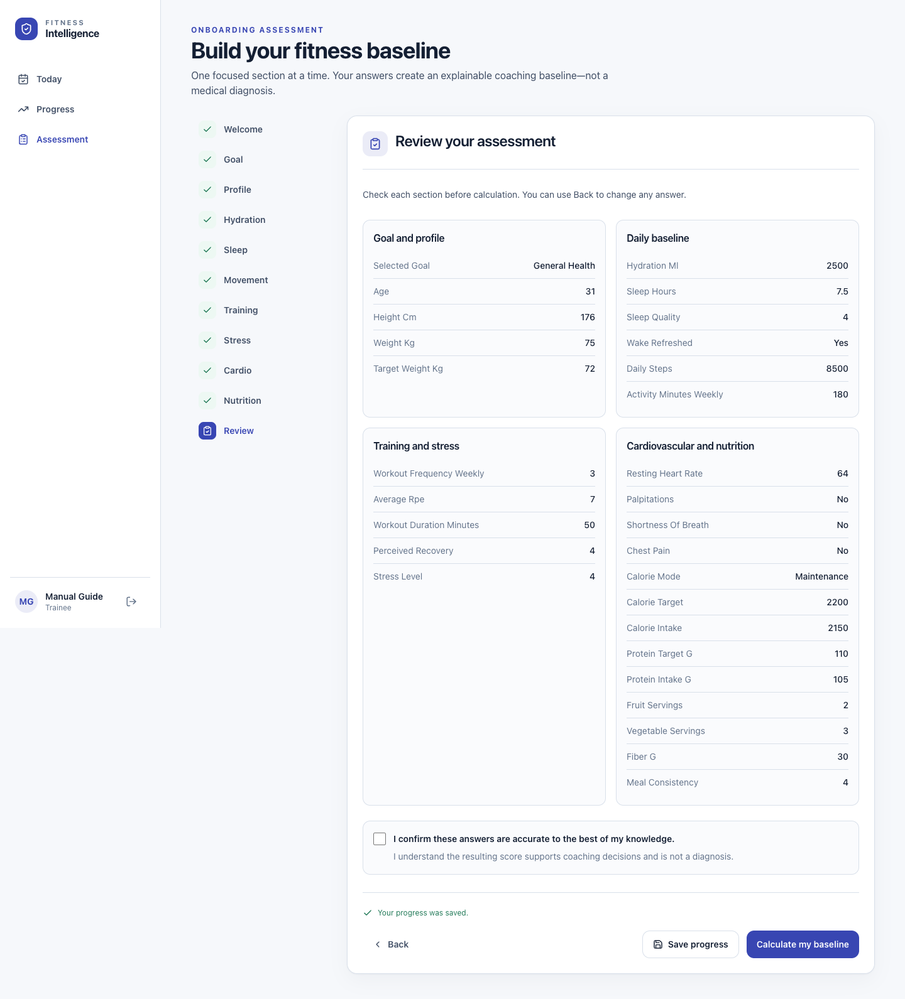
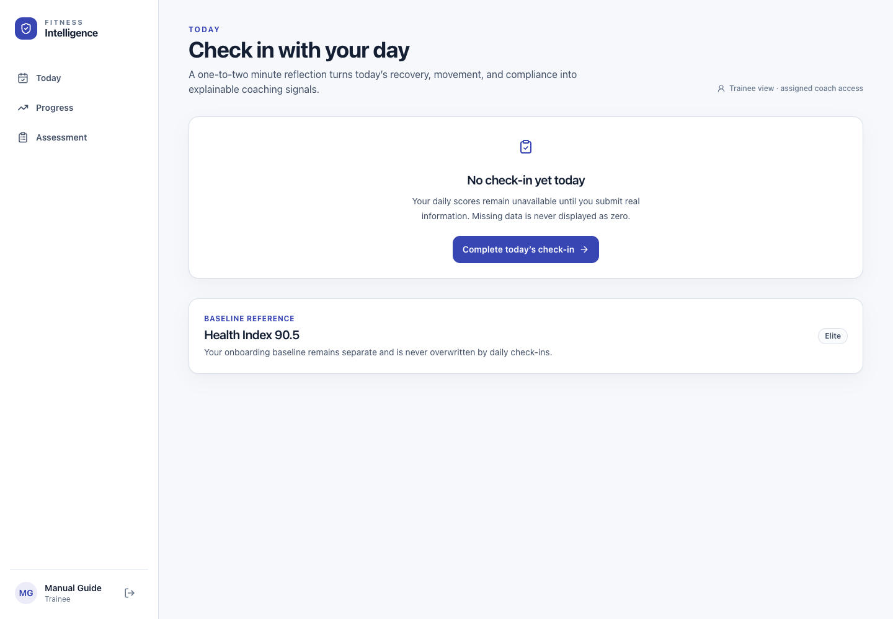
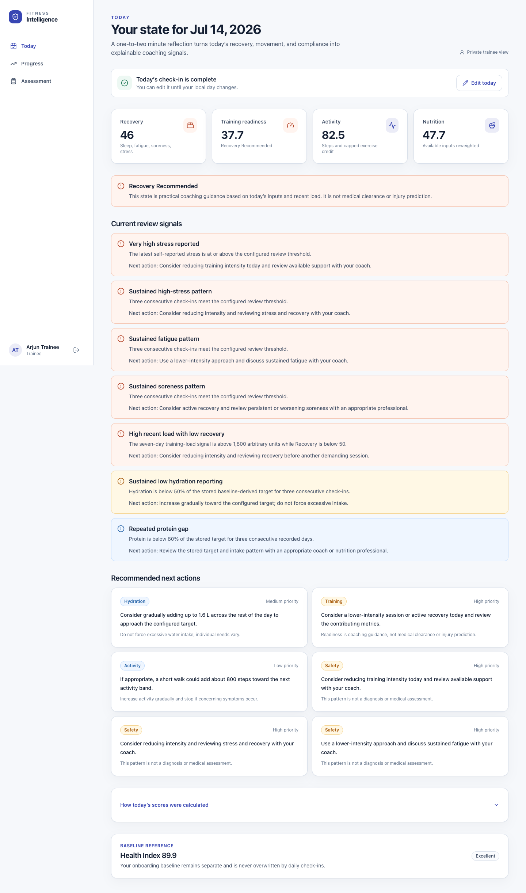
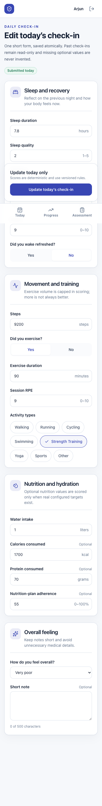
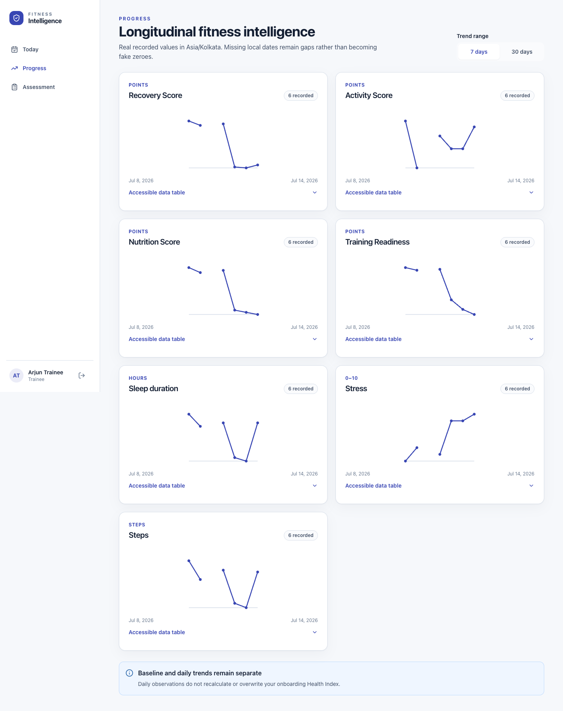

# Trainee User Manual

This manual explains the trainee experience that is available in the current Fitness Intelligence Platform. It uses the exact labels shown in the application and describes current limitations as well as available features.

The platform provides coaching support based on information that you report. It does not diagnose a condition, provide emergency care, or replace a doctor, registered dietitian, physiotherapist, or qualified coach.

New to the platform? Read [Getting started](getting-started.md) and the [Product guide](product-guide.md) first.

## Public demo access

From sign-in, select **Explore Demo**, then **View as Trainee**. The demo opens fictional baseline,
daily, Program, and workout-execution examples. You can inspect scheduled, active, completed, and
partial workouts, but all persistent changes are disabled and rejected by the backend. A persistent
banner identifies the workspace as synthetic and read-only; select **Exit demo** to leave.

This does not change normal trainee enrollment: an ordinary trainee account still requires a private, single-use invitation from its coach.

## Contents

1. [Your role and navigation](#1-your-role-and-navigation)
2. [Register as a trainee](#2-register-as-a-trainee)
3. [Sign in](#3-sign-in)
4. [Complete onboarding](#4-complete-onboarding)
5. [Review and submit the assessment](#5-review-and-submit-the-assessment)
6. [Understand your Health Index](#6-understand-your-health-index)
7. [Use Today](#7-use-today)
8. [Complete a daily check-in](#8-complete-a-daily-check-in)
9. [Understand daily scores](#9-understand-daily-scores)
10. [View progress and trends](#10-view-progress-and-trends)
11. [Understand recommendations and alerts](#11-understand-recommendations-and-alerts)
12. [Privacy and coach visibility](#12-privacy-and-coach-visibility)
13. [Sign out and handle session expiry](#13-sign-out-and-handle-session-expiry)
14. [Common trainee scenarios](#14-common-trainee-scenarios)
15. [Current limitations](#15-current-limitations)

## 1. Your role and navigation

As a trainee, you can:

- register with a private, single-use invitation created by a coach;
- complete and submit one onboarding baseline through the current interface;
- submit or update the current local day's check-in;
- view today's daily scores, readiness state, alerts, and recommendations;
- view 7-day or 30-day trends; and
- review your locked onboarding answers after submission.

The trainee navigation contains three destinations:

| Label | Purpose |
|---|---|
| **Today** | Complete today's check-in or review today's scores, recommendations, alerts, and compact baseline reference. |
| **Progress** | View 7-day or 30-day trend charts and data tables. |
| **Assessment** | Complete onboarding, resume a draft, or review submitted answers. |

On a desktop-sized screen, these links appear in the left sidebar. On a smaller screen, they appear in a fixed navigation bar at the bottom. The profile area and **Sign out** control are in the sidebar on desktop; the first name and **Sign out** icon are in the top header on smaller screens.

## 2. Register as a trainee

Registration begins with an account-type choice. Choose **Trainee** and use the private invitation code or link supplied by your coach. Login itself has no role selector.

### Procedure

1. Open the application registration page, or select **Create an account** on the sign-in page.
2. Enter your **First name** and **Last name**.
3. Enter your **Email address**.
4. In **Create a password**, enter at least 10 characters. Use the **Show password** button if you need to check what you typed; select **Hide password** to conceal it again.
5. Enter the **Coach invitation code**. A link from your coach prefills this field and removes the secret from the visible browser address after loading.
6. Select **Create trainee account**.
7. When registration succeeds, the application signs you in and opens the onboarding assessment.

The invitation identifies the issuing coach. Successful registration consumes the invitation and assigns the trainee to that coach. Trainees cannot browse or select coaches publicly.

### Registration errors

- Used, expired, revoked, email-mismatched, and invalid invitations produce the same generic registration failure so invitation details are not exposed.
- An already registered email also produces a generic registration conflict.
- Field or service errors appear on the same page. Correct the highlighted value or try again. The application does not provide email verification, account recovery, or a password-reset flow.

> **Local synthetic testing only:** Repository seed identities and compatibility values are not production credentials. The application does not display them.

## 3. Sign in

### Procedure

1. Open the application sign-in page.
2. Enter your **Email address**.
3. Enter your **Password**.
4. If needed, select **Show password** to reveal it and **Hide password** to conceal it.
5. Select **Sign in**.
6. A trainee account is routed to **Today**. A coach account is routed to the coach workspace.

If the email or password is incorrect, the page shows **Sign-in unsuccessful** and **Email or password is incorrect**. If the service cannot be reached, the page explains that sign-in could not be completed and allows you to retry.

The sign-in page does not display credentials. When public demo mode is enabled, **Explore Demo** opens a controlled synthetic read-only session without an email or password; normal sign-in remains email-and-password based.

## 4. Complete onboarding

The onboarding assessment creates a baseline from your submitted answers. It has 11 steps and uses metric units. The introductory screen estimates about eight minutes, but you can save and resume.

The steps appear in a left-hand list on desktop. On smaller screens, a progress bar displays **Step _n_ of 11** and a percentage.

### How movement between steps works

1. Complete every required field in the current step.
2. Select **Save and continue**. The page validates the step and saves the complete draft before moving forward.
3. Select **Back** to return one step.
4. On desktop, you can also select any already reached step in the step list. Future steps remain disabled until you reach them.
5. Select **Save progress** to save a partial draft without advancing.

The first successful save creates the draft. After that, the page displays **Your progress was saved** or the most recent save time. When you return to **Assessment**, the application loads the draft and normally opens the first step with a missing required answer.

If you enter a value outside its allowed range, an error appears beneath the field. A missing required answer is marked **This field is required**, and the page displays **Check this section**. An invalid entered value can also prevent **Save progress** even when that field is on an earlier step; use **Back** to locate and correct it.

### Step 1: Welcome

The **Welcome** step explains:

- the areas covered by the assessment;
- that measurements use kilograms, centimetres, and millilitres;
- that calculations are explainable; and
- that onboarding information is sensitive.

There are no fields on this step. Select **Save and continue**.

### Step 2: Choose your fitness goal

Select one required goal:

- **Fat loss**
- **Muscle gain**
- **Strength**
- **Endurance**
- **General health**
- **Athletic performance**

The goal changes configured references such as sleep and hydration targets. It does not create a medical, meal, or training prescription.

### Step 3: Build your basic profile

| Field | Required? | Allowed value |
|---|---|---:|
| **Age** | Yes | 16–100 years |
| **Height** | Yes | 100–250 cm |
| **Current weight** | Yes | 30–350 kg |
| **Target weight** | No | 30–350 kg |

These measurements support weight-relative calculations. They are not used to diagnose a condition.

### Step 4: Understand your hydration

| Field | Required? | Allowed value |
|---|---|---:|
| **Typical daily water intake** | Yes | 0–10,000 ml |

Enter a typical day, not your best day. The calculated target uses your submitted weight and goal. Scoring credit is capped, and the interface warns you not to force excessive water intake.

### Step 5: Tell us about your sleep

| Field | Required? | Allowed value |
|---|---|---:|
| **Average sleep duration** | Yes | 0–16 hours |
| **Sleep quality** | Yes | 1–5 |
| **Do you usually wake feeling refreshed?** | Yes | **Yes** or **No** |

Duration, perceived quality, and the refreshed response contribute to the sleep component.

### Step 6: Describe your daily movement

| Field | Required? | Allowed value |
|---|---|---:|
| **Typical daily steps** | Yes | 0–100,000 steps |
| **Activity each week** | Yes | 0–5,000 minutes |
| **Activities you currently do** | No | Any available activity chips |

Available activity choices include walking, running, swimming, cycling, HIIT, strength training, functional training, Pilates, yoga, sports, gardening, housework, stair climbing, and active commuting. The activity names add context; they are not ranked against one another.

### Step 7: Describe your training habits

| Field | Required? | Allowed value |
|---|---|---:|
| **Workouts each week** | Yes | 0–14 sessions |
| **Average effort** | Yes | RPE 0–10 |
| **Typical workout duration** | No | 0–600 minutes |
| **Perceived recovery** | No | 1–5 |

RPE means rating of perceived exertion: 0 represents rest and 10 represents maximal perceived effort. These answers describe your recent pattern; they do not diagnose overtraining or predict injury.

### Step 8: Check in on stress

| Field | Required? | Allowed value |
|---|---|---:|
| **Current stress level** | Yes | 0–10 |

Zero means no reported stress and 10 means very high reported stress. A higher value reduces this component score, but it is not a diagnosis.

### Step 9: Cardiovascular information

All fields in this step are optional:

| Field | Allowed value |
|---|---:|
| **Resting heart rate** | 30–220 bpm |
| **Palpitations** | Selected or not selected |
| **Shortness of breath** | Selected or not selected |
| **Chest discomfort** | Selected or not selected |

Select a symptom only if you have recently experienced it. These responses can trigger review or safety guidance; they do not diagnose a condition.

> **Immediate safety guidance:** Seek immediate professional medical help if chest pain or breathing difficulty is severe, worsening, or happening now. Do not wait for an application score or coach response.

### Step 10: Nutrition baseline

First select the required **Current calorie approach**: **Maintenance**, **Deficit**, or **Surplus**.

All remaining fields are optional:

| Field | Allowed value |
|---|---:|
| **Entered calorie target** | 800–8,000 kcal |
| **Estimated intake** | 0–10,000 kcal |
| **Protein target** | 0–500 g |
| **Protein intake** | 0–500 g |
| **Fruit** | 0–30 servings |
| **Vegetables** | 0–30 servings |
| **Fiber** | 0–150 g |
| **Meal consistency** | 1–5 |

Only entered values are used. The platform does not invent or medically prescribe a calorie target. Carbohydrate and fat intake are not enterable in the current onboarding interface.

### Step 11: Review your assessment

The final step groups your visible answers into:

- **Goal and profile**
- **Daily baseline**
- **Training and stress**
- **Cardiovascular and nutrition**

Activity-type selections are not included in this review grid even though they are retained with the draft. Use **Back** if you need to review or change them.

## 5. Review and submit the assessment

### Procedure

1. Read each answer in **Review your assessment**.
2. To change an answer, select **Back** repeatedly or, on desktop, select an already completed step in the step list.
3. Return to **Review**.
4. Select **I confirm these answers are accurate to the best of my knowledge.**
5. Select **Calculate my baseline**.
6. The application saves the assessment, creates an immutable Health Index snapshot, and routes you to **Today**.

If a required answer is missing, the page reports that the assessment still has required fields to complete. If acknowledgement is missing, it asks you to confirm accuracy before calculation. If submission fails after a successful draft save, your saved assessment remains available so you can retry.

### After submission

Selecting **Assessment** now opens **Your submitted baseline**. It shows the submitted answers and a **Baseline locked** notice. The current interface does not allow those submitted answers to be edited and does not offer a **Start new assessment** action.

The locked state prevents a normal duplicate submission through the interface. At the service level, repeating submission for the same saved assessment returns its existing result rather than creating a second result.

> **Important current limitation:** After submission, trainees cannot open the full Health Index breakdown. **Assessment** shows locked answers, while **Today** shows only a compact **Baseline reference** with the Health Index number and band. Component weights, contributions, baseline recommendations, missing-field details, and scoring version exist in the stored result and are visible in the assigned coach's detail view, but no current trainee route displays the full breakdown.

## 6. Understand your Health Index

The Health Index is a deterministic 0–100 baseline calculated from the submitted onboarding assessment. “Deterministic” means the same validated answers processed by the same scoring version produce the same result. An AI model does not invent the score.

The baseline combines hydration, sleep, nutrition, stress, cardiovascular information, workout intensity, physical activity, daily steps, goal alignment, and assessment completion. Each component has a configured weight. Its normalized component score multiplied by that weight produces a weighted contribution to the overall result.

### Interpretation bands

| Score | Product band |
|---:|---|
| 90–100 | Elite |
| 80–89.9 | Excellent |
| 70–79.9 | Good |
| 60–69.9 | Average |
| 40–59.9 | Needs Improvement |
| Below 40 | High Risk |

These are product labels, not medical classifications. A lower score is not a judgment about you. It reflects the submitted information, configured reference ranges, and handling of available or missing optional information.

### What you can currently see

On **Today**, the compact **Baseline reference** displays:

- the overall Health Index number;
- the interpretation band; and
- a reminder that daily check-ins do not overwrite the baseline.

On **Assessment**, you can review the submitted source answers, but not the full result breakdown.

### Demonstration example

The screenshot above is a seeded local demonstration example. It shows **Health Index 90.5** with the **Elite** band. It is not a target, clinical result, or prediction, and another trainee's answers can produce a different result.

The stored Health Index also contains the baseline calculation date, component scores, status labels, weights, weighted contributions, structured recommendations, review notices, missing optional fields, and scoring version. The assigned coach can review those details. They are currently unavailable in the trainee interface.

For the technical rules, see [Health Index v1](scoring/health-index-v1.md).

## 7. Use Today

**Today** is the trainee landing page after sign-in.

Before a check-in, it displays **No check-in yet today** and a **Complete today's check-in** action. Missing information is not displayed as zero. If a baseline exists, the compact **Baseline reference** appears below the empty state.

After a successful check-in, **Today** displays:

- **Today's check-in is complete** and **Edit today**;
- **Recovery**;
- **Training readiness**;
- **Activity**;
- **Nutrition**, or an unavailable mark when there are insufficient configured targets;
- the current readiness-state notice;
- **Current review signals**, when rules are triggered;
- **Recommended next actions**; and
- **How today's scores were calculated**, an expandable component explanation.

The date is based on the trainee's stored local timezone. You can update only the current local day's entry.

## 8. Complete a daily check-in

The interface describes the check-in as a one-to-two minute reflection. Complete it when the day's sleep, recovery, movement, hydration, and nutrition information is meaningful enough to report consistently. There is no reminder or notification feature.

### Procedure

1. On **Today**, select **Complete today's check-in**. You can also open the check-in route by selecting **Edit today** after submission.
2. Complete **Sleep and recovery**.
3. Complete **Movement and training**. If you select **Yes** for **Did you exercise?**, complete the conditional exercise fields.
4. Complete **Nutrition and hydration**.
5. Choose an **Overall feeling** and optionally add a **Short note**.
6. Select **Submit today's check-in**.
7. Wait for **Check-in saved**. Select **View today's scores** to return to **Today**.

The complete form is saved as one operation; there is no daily-check-in draft. If saving fails, the page says that valid entries remain on the page so you can retry.

### Fields and validation

| Section | Field | Required? | Allowed value / choices |
|---|---|---|---|
| Sleep and recovery | **Sleep duration** | Yes | 0–16 hours |
| Sleep and recovery | **Sleep quality** | Yes | Whole number 1–5 |
| Sleep and recovery | **Soreness** | Yes | Whole number 0–10 |
| Sleep and recovery | **Fatigue** | Yes | Whole number 0–10 |
| Sleep and recovery | **Stress** | Yes | Whole number 0–10 |
| Sleep and recovery | **Did you wake refreshed?** | Yes | **Yes** or **No** |
| Movement and training | **Steps** | Yes | Whole number 0–100,000 |
| Movement and training | **Did you exercise?** | Yes | **Yes** or **No** |
| Movement and training | **Exercise duration** | Only when exercise is **Yes** | Whole number 1–600 minutes |
| Movement and training | **Session RPE** | Only when exercise is **Yes** | 0–10 |
| Movement and training | **Activity types** | No | Walking, running, cycling, swimming, strength training, yoga, sports, other |
| Nutrition and hydration | **Water intake** | Yes | 0–12 liters |
| Nutrition and hydration | **Calories consumed** | No | 0–10,000 kcal |
| Nutrition and hydration | **Protein consumed** | No | 0–500 grams |
| Nutrition and hydration | **Nutrition-plan adherence** | No | Whole number 0–100% |
| Overall feeling | **How do you feel overall?** | Yes | Very poor, Poor, Okay, Good, Excellent |
| Overall feeling | **Short note** | No | Up to 500 characters |

The form initially contains neutral or zero defaults, including 7.5 hours of sleep, sleep quality 3, **No** for waking refreshed and exercise, and **Okay** overall. Review every value before submitting; a prefilled value is not confirmation that it describes your day.

If exercise is **Yes** and a conditional field is empty, the form displays **Enter the exercise duration** or **Enter the session RPE**. Out-of-range and non-whole-number values are rejected where the table requires a whole number.

### Edit today's check-in

1. Open **Today**.
2. Select **Edit today**.
3. Change the appropriate values.
4. Select **Update today's check-in**.
5. The current day's check-in and deterministic daily score are updated.

Past check-ins are read-only. The current interface has no control for opening or editing an earlier day's form. If the current local day changes while the form is open, reload before attempting an update.

## 9. Understand daily scores

Daily scores are versioned coaching signals created from a daily check-in. They do not recalculate, replace, or overwrite the onboarding Health Index.

### Recovery Score

**What it measures:** Today's reported recovery context.

**Inputs:** Sleep duration, sleep quality, waking refreshed, fatigue, soreness, and stress.

**Use it for:** Reviewing which recovery inputs may support or limit the day's training plan.

**It does not mean:** Medical recovery, absence of illness, injury status, or clearance to exercise.

### Activity Score

**What it measures:** Reported steps and exercise participation, duration, and activity mix.

**Inputs:** Steps, whether exercise occurred, exercise minutes, and selected activity types.

**Use it for:** Understanding daily movement in the context of configured scoring bands.

**It does not mean:** That unlimited exercise is better. Exercise-duration credit is capped, and activity types are not ranked.

### Nutrition Score

**What it measures:** Available hydration, protein, and self-reported adherence information.

**Inputs:** Water intake, stored baseline-derived targets when available, protein intake and a stored protein target when both exist, and optional nutrition-plan adherence.

**Use it for:** Reviewing available daily compliance signals.

**It does not mean:** A medical nutrition assessment or a meal prescription. Calories are retained as context but do not affect Daily Nutrition v1. If no valid nutrition components exist, the score is unavailable rather than zero.

### Training Readiness Score

**What it measures:** A combination of the Recovery Score and tolerance for reported training load across the current local day and previous six calendar dates.

**Inputs:** Recovery Score and training load calculated from exercise minutes multiplied by session RPE.

**Use it for:** Supporting a conversation about whether to maintain, reduce, or adapt the day's planned intensity.

**It does not mean:** Medical or professional clearance, an injury prediction, or detection of overtraining.

### Readiness states

| Score | State | Practical interpretation |
|---:|---|---|
| 80–100 | **Ready to push** | Reported recovery and recent load support considering the planned session. This is not clearance. |
| 60–79.9 | **Maintain** | Consider maintaining the planned approach while monitoring how you feel. |
| 40–59.9 | **Reduce intensity** | Consider a lower-intensity session or active recovery and review contributing values. |
| Below 40 | **Recovery recommended** | Give recovery priority and discuss concerns with your coach or an appropriate professional. |

Select **How today's scores were calculated** to inspect the available daily components, normalized values, and explanations. A component can say **Unavailable** when required target context is missing.

For technical calculation details, see [Daily Intelligence v1](scoring/daily-intelligence-v1.md).

## 10. View progress and trends

### Procedure

1. Select **Progress**.
2. Under **Trend range**, choose **7 days** or **30 days**.
3. Review the available charts. Current series can include Recovery Score, Activity Score, Nutrition Score, Training Readiness, Sleep duration, Stress, and Steps.
4. Select **Accessible data table** beneath a chart to view **Local date**, **Value**, and **Change** for each date.

Each card shows how many values were recorded. A line breaks at a missing local date instead of dropping to zero. In the table, a missing date says **Missing**, and a missing comparison says **—**. **Change** is the numeric difference from the previous recorded value, not a percentage and not a comparison with your Health Index.

Use trends to look for context and consistency, not to diagnose a condition from one rise or fall. Discuss sustained or concerning changes with your coach or an appropriate professional.

### Current trend limitations

- Only **7 days** and **30 days** are selectable in the interface.
- There is no custom date range, baseline overlay, goal line, export, or annotation control.
- Rolling-average data may exist in the service response, but the current trainee page does not display a rolling-average line or value.
- The chart has date endpoints and point details but no visible vertical-axis scale; use **Accessible data table** for exact values.
- There is no control to open an old check-in from a chart.

If every series is empty, the page displays **No trend data yet** and links to **Complete a check-in**. One submitted day begins the history, but a useful pattern requires multiple recorded days.

## 11. Understand recommendations and alerts

### Recommended next actions

After a check-in, **Recommended next actions** can include hydration, recovery, training, activity, or safety guidance. Recommendations are structured from configured rules and the actual submitted values. They are not free-form AI advice.

Priorities can be **High**, **Medium**, or **Low**. A higher priority places greater emphasis on reviewing the action; it does not turn the recommendation into a diagnosis or emergency service. Some cards include safety text. Read it before changing activity or intake.

Examples of contributing conditions include a configured hydration gap, short sleep opportunity, a lower-readiness state, steps below the next activity band, or a triggered review rule.

### Current review signals

When a daily rule is triggered, **Today** displays **Current review signals** with:

- the alert title;
- an explanation;
- a severity-based visual style; and
- **Next action** guidance.

Daily alerts can use these severities:

| Severity | Meaning in the product |
|---|---|
| **Informational** | Context worth knowing; not an urgent finding. |
| **Review** | A reported value or pattern suggests coach review. |
| **Elevated** | A stronger configured concern that deserves prompt review and an appropriate adjustment. |

Baseline onboarding rules also use **Urgent** for reported chest discomfort or shortness of breath. In the current trainee interface, the immediate cardiovascular safety notice is visible during onboarding, but the full post-submission baseline alert list is not available to the trainee because the full baseline result page is not routed.

Daily rules can respond to one day's value or a repeated pattern. Missing calendar dates break rules that require consecutive days. Alerts are deterministic product signals; they do not diagnose dehydration, illness, injury, or overtraining.

> **Do not use a good score to dismiss symptoms.** Seek immediate professional medical help for severe, worsening, or current chest pain or breathing difficulty. Contact an appropriate professional for persistent or concerning symptoms. The platform and your coach are not emergency services.

## 12. Privacy and coach visibility

Your onboarding and daily information is sensitive.

The current authorization rules allow:

- you to access your own trainee data;
- your actively assigned coach to access your baseline result and date-bounded daily records; and
- no unrelated coach to gain access merely by changing a trainee identifier or URL.

The coach detail screen currently displays your overall baseline and full component breakdown, baseline recommendations and review notices, latest daily scores, a summary of the latest check-in, recent check-in summaries, daily recommendations, alerts, and trends.

The service also authorizes the assigned coach to retrieve the underlying date-bounded check-in records, including the optional note. The current coach screen does not display every raw field or the note, but you should still write a **Short note** as information shared within the assigned coaching relationship. Avoid unnecessary medical or highly sensitive details.

Coaches have read-only daily endpoints in the current implementation. They cannot edit your check-ins, change your submitted assessment, write a note into your record, resolve alerts through the interface, or send a message. They can assign a published Program version, which creates a read-only date schedule for you.

The **Your coach** card on **Today** shows whether a coaching assignment is active, plus the available coach name and email. Selecting the email uses your device's external email application; FitIntel 360 has no in-app messaging. The relationship does not mean the coach continuously monitors the application, will respond immediately, holds verified credentials, or provides medical supervision. In the public demo, this card is explicitly labeled as synthetic sample information.

Authentication currently stores an expiring access token in browser local storage. This current-milestone design may be used only with synthetic data in staging and requires further security hardening for production use. The repository does not claim HIPAA, GDPR, or other legal compliance. See [Security and compliance notes](security.md) for the implemented controls and known production gaps.

## 12A. View My Program

Open **Program** to see the exact published Program version assigned by your coach. Dates use your
profile timezone. The page identifies your current week, today's scheduled workout or rest day,
future weeks, required and optional workouts, and coach-authored deload weeks.

Select **Open workout** for duration, target RPE, exercise count, instructions, and execution.
For an eligible scheduled workout, select **Start workout**. The system copies the exact published
exercise order and prescriptions into a session; later template revisions do not alter it.

During an active workout:

1. Review the planned values and safety cues for the current exercise.
2. Enter only the actual fields shown for its tracking mode. External load and optional assistance
   accept kg or lb; assistance is not resistance load.
3. Select **Save completed set**, or **Skip set**. The status text moves through unsaved, saving,
   saved, or error states; typing alone does not save.
4. Use **Add set** for an extra set without changing the coach's prescription.
5. Use **Skip exercise** with a reason when appropriate; its remaining planned sets become skipped.
6. Move with **Previous** and **Next**. You may leave or refresh after a successful save and reopen
   the same workout to resume it; a second session is not created.

If another tab saves first, the page preserves your typed values and shows **Workout updated
elsewhere**. Select **Reload latest session** only when ready to load the current server revision;
changes are not merged automatically.

To finish normally, resolve every exercise by completing or explicitly skipping it, enter actual
duration and session RPE, confirm, and select **Complete workout**. To stop before that, choose a
bounded reason and **End workout incomplete**. Both outcomes preserve a summary and are immutable;
there is no reopen or correction workflow. Cancelled and superseded entries cannot start. If a
future replacement exists, the page shows its effective date and does not rewrite past history.

## 13. Sign out and handle session expiry

### Sign out

1. Find your profile area.
2. Select the arrow-shaped **Sign out** control. Its accessible label is **Sign out**.
3. The application removes the local session and returns to the sign-in page.

On a shared device, always sign out when finished. Closing a tab is not the same as signing out because the current session is stored in the browser.

### Session expiry

When the service rejects an expired session, the application clears the stored session and returns to sign-in with:

> **Session ended** — Your session expired. Sign in again to continue.

Sign in again with your email and password. Unsaved daily-form changes are not guaranteed to survive a session expiry or page reload. An onboarding draft remains available only up to its last successful save.

## 14. Common trainee scenarios

### I closed the browser during onboarding

1. Sign in again.
2. Select **Assessment**.
3. The application loads the last successfully saved draft and normally opens the first incomplete required step.
4. Re-enter anything changed after the last successful save.
5. Continue with **Save and continue**.

### My onboarding draft contains an error

1. Read **Check this section** and the message under the highlighted field.
2. Enter a value within the range in [Complete onboarding](#4-complete-onboarding).
3. If **Save progress** reports an error but no current field is highlighted, use **Back** to inspect previously entered optional values.
4. Save again.

### My assessment will not submit

1. Confirm all required steps are complete.
2. Use **Back** to correct any highlighted field.
3. Return to **Review**.
4. Select **I confirm these answers are accurate to the best of my knowledge.**
5. Select **Calculate my baseline** again.
6. If the service is unavailable, keep the saved draft and retry later.

### My Health Index is lower than expected

1. Remember that the number reflects reported data and configured product rules, not a judgment or diagnosis.
2. Open **Assessment** to review the locked source answers.
3. Discuss the full component breakdown with your assigned coach, because that breakdown is not currently available in the trainee interface.
4. Do not change health behavior solely to chase a score.

### I cannot find my full Health Index breakdown

This is a current interface limitation, not a hidden menu:

- **Today** shows only the compact overall score and band under **Baseline reference**.
- **Assessment** shows locked submitted answers.
- No trainee route currently displays baseline components, contributions, recommendations, missing fields, or the scoring version.

Ask your assigned coach to review the full breakdown with you.

### I have no coach assigned

The current registration flow normally creates an active assignment automatically. **Today** reports when no coach is assigned or when the previous relationship is inactive. There is no trainee-facing coach-management page. If the assignment is missing or incorrect, contact the person operating the local application; you cannot select or change a coach yourself.

### I missed a daily check-in

Leave the date missing. The platform does not turn it into zero, and the current interface does not allow a backdated check-in. Resume with the current day's check-in. A missing date can break a rule that requires consecutive check-ins.

### I submitted incorrect information today

1. Open **Today** on the same local day.
2. Select **Edit today**.
3. Correct the values.
4. Select **Update today's check-in**.

After the local day changes, the entry is read-only in the current interface.

### I submitted incorrect onboarding information

Open **Assessment** to confirm what was submitted. Submitted answers are locked, and the current interface offers no correction or new-assessment workflow. Contact the local application operator and your coach; do not assume that changing a daily check-in changes the baseline.

### My check-in will not save

1. Correct any field-level errors.
2. If **Did you exercise?** is **Yes**, provide **Exercise duration** and **Session RPE**.
3. Select the submit or update button again.
4. If a service error appears, keep the page open; valid entries remain on the form for a retry.
5. If the page was open across the local date change, reload before retrying.

### My Progress chart is empty

1. Confirm that at least one daily check-in was successfully saved.
2. Select the other **Trend range** if appropriate.
3. Remember that optional Nutrition can be unavailable if no valid configured targets or inputs exist.
4. Missing dates remain blank rather than zero.

### The API or service is unavailable

The application displays **We could not load this page** or **The service is unavailable**, usually with **Try again**. Keep any unsaved form page open, restore the local service or connection, and retry. For setup help, see [Troubleshooting](troubleshooting.md).

### My session expired

Return to sign-in and authenticate again. Then reopen **Assessment**, **Today**, or **Progress**. Only successfully saved data is restored.

### I see a medical-safety notice

Read the notice and follow the recommended professional-care guidance. For severe, worsening, or current chest pain or breathing difficulty, seek immediate professional medical help. Do not wait for the score to change or for a coach to respond.

## 15. Current limitations

The trainee experience currently does not provide:

- a full trainee-facing Health Index result page after submission;
- editing or versioning of a submitted onboarding assessment;
- backdated or future daily check-ins;
- editing of past check-ins;
- custom trend ranges, visible rolling averages, exports, or reports;
- coach selection or assignment management;
- coach invitations through the trainee interface;
- workout-program building, post-completion workout correction, or nutrition-plan creation;
- workout safety reports, readiness capture, load analytics, or adherence analytics;
- messaging, coach notes, reminders, or notifications;
- wearable or device connections;
- AI-generated narration;
- clinical reporting, emergency monitoring, predictive injury detection, or computer vision;
- account recovery, password reset, or multi-factor authentication; or
- a native mobile application. The responsive web interface can be used in a mobile browser.

For product questions, see the [FAQ](faq.md). For errors and local-service problems, see [Troubleshooting](troubleshooting.md). Technical readers can consult [Health Index v1](scoring/health-index-v1.md), [Daily Intelligence v1](scoring/daily-intelligence-v1.md), and [Security and compliance notes](security.md).
